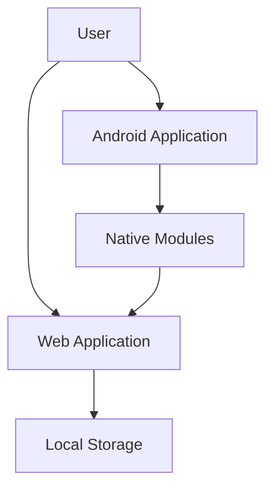

# SmartWardrobe

SmartWardrobe is a comprehensive personal wardrobe management solution that helps users organize their clothing, plan outfits, and receive daily recommendations. The project consists of a cross-platform architecture with a Web Application and an Android Application.

## 🏗 Project Architecture

## 🛠 Tech Stack

### Web Application
- **Frontend**: HTML5, CSS3, JavaScript (ES6+)
- **Storage**: LocalStorage API
- **Internationalization**: Custom i18n implementation
- **Theme**: Light/Dark mode support

### Android Application
- **Language**: Kotlin/Java
- **IDE**: Android Studio
- **WebView**: Integration with WebApp

## 🚀 Quick Navigation

- [Web Application Documentation](App/WebApp/README.md)
- [Android Application Documentation](App/AndroidApp/README.md)
- [User Guide](USER_GUIDE.md)

## 💻 Developer Guide

### Web Development
For web development tasks, including UI updates and logic changes:
[Go to Web Development Guide](App/WebApp/README.md)

### Android Development
For native feature implementation and APK building:
[Go to Android Development Guide](App/AndroidApp/README.md)

---
**Version**: 1.1.0
**Last Updated**: 2026-02-19
**Maintainer**: SmartWardrobe Team
