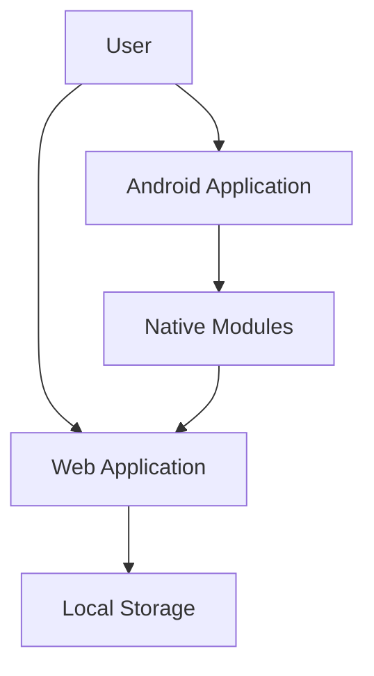

# SmartWardrobe

SmartWardrobe is a comprehensive personal wardrobe management solution that helps users organize their clothing, plan outfits, and receive daily recommendations. The project consists of a cross-platform architecture with a Web Application and an Android Application.

## 🏗 Project Architecture


```mermaid
graph TD
    User[User] --> WebApp[Web Application]
    User --> AndroidApp[Android Application]
    WebApp --> LocalStorage[Local Storage]
    AndroidApp --> NativeModules[Native Modules]
    NativeModules --> WebApp
```

## 📦 Project Structure

### 📂 Directories

- **`App/`**: Contains the source code for the Web and Android applications.
- **`backend/`**: Local backend service (Python) and shared utilities (MySQL, validation, handlers).
- **`images/`**: Stores general project assets and images.
- **`node_modules/`**: Dependencies installed via npm.
- **`scripts/`**: Utility scripts, including the automated Android installer.

### 📄 Files

- **`.gitignore`**: Specifies files and directories to be ignored by Git.
- **`AppLogo.jpg`**: The official logo of the SmartWardrobe application.
- **`package-lock.json`**: Auto-generated file that locks the versions of npm dependencies.
- **`package.json`**: Defines project metadata, scripts, and dependencies.
- **`README.md`**: The main entry point for project documentation.
- **`SERVER_SETUP.md`**: Comprehensive guide for setting up the backend server environment.
- **`server.py`**: Local dev server entrypoint (serves WebApp static files + backend APIs).
- **`SmartWardrobe.apk`**: The compiled Android application package file.
- **`USER_GUIDE.md`**: Instructions and manual for end-users of the application.

## 🧩 Local Backend

Run the integrated local server (static WebApp + APIs):

```bash
python3 server.py
```

Default port is `8080` (set `PORT` to change). The server also supports MySQL-backed APIs (i18n/favorites/schedules) and will auto-create required tables when MySQL is reachable.

## 🛠 Tech Stack

### Web Application
- **Frontend**: HTML5, CSS3, JavaScript (ES6+)
- **Storage**: LocalStorage API
- **Internationalization**: Custom i18n implementation
- **Theme**: Light/Dark mode support

### Android Application
- **Language**: Kotlin/Java
- **IDE**: Android Studio
- **WebView**: Integration with WebApp

## 🚀 Quick Navigation

- [Web Application Documentation](App/WebApp/README.md)
- [Android Application Documentation](App/AndroidApp/README.md)
- [User Guide](USER_GUIDE.md)

## 💻 Developer Guide

### Web Development
For web development tasks, including UI updates and logic changes:
[Go to Web Development Guide](App/WebApp/README.md)

### Android Development
For native feature implementation and APK building:
[Go to Android Development Guide](App/AndroidApp/README.md)

---
**Version**: 1.2.0
**Last Updated**: 2026-03-14
**Maintainer**: SmartWardrobe Team
