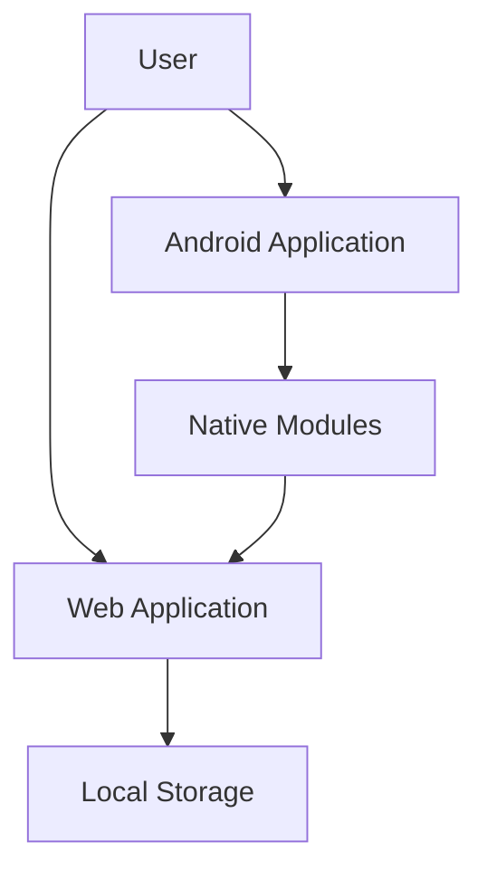

# SmartWardrobe

SmartWardrobe is a comprehensive personal wardrobe management solution that helps users organize clothing, plan outfits, and iterate on cross-platform experiences.

## 🏗 Project Architecture


```mermaid
graph TD
    User[User] --> WebApp[Web Application]
    User --> AndroidApp[Android Application]
    WebApp --> LocalStorage[Local Storage]
    AndroidApp --> NativeModules[Native Modules]
    NativeModules --> WebApp
```

## 📦 Project Structure

### 📂 Directories

- **`apps/web/`**: Current main web app under active development.
- **`apps/android/`**: Android client.
- **`services/backend/`**: Lightweight local backend for frontend-first development.
- **`services/closettwin/`**: ClosetTwin dual-model service boundary used by the backend facade.
- **`docs/product/`**: Product-facing documentation.
- **`docs/superpowers/`**: Planning and spec documents.
- **`scripts/dev/`**: Start scripts for local development.
- **`scripts/android/`**: Android tooling scripts.
- **`scripts/data/`**: Data/bootstrap scripts.
- **`assets/`**: Branding assets, APKs, and archived placeholders.

## 🧩 Local Backend

Run the lightweight integrated server for the new web app (static frontend + APIs):

```bash
zsh ./scripts/dev/start_backend.sh
```

Default port is `8140` (set `BACKEND_PORT` to change).

## 🛠 Tech Stack

### Web Application
- **Frontend**: HTML5, CSS3, JavaScript (ES6+)
- **Storage**: LocalStorage API
- **Internationalization**: Custom i18n implementation
- **Theme**: Light/Dark mode support

### Android Application
- **Language**: Kotlin/Java
- **IDE**: Android Studio
- **WebView**: Integration with WebApp

## 🚀 Quick Navigation

- [New Web App](apps/web/)
- [Android Application Documentation](apps/android/README.md)
- [User Guide](docs/product/USER_GUIDE.md)
- [Server Setup](docs/product/SERVER_SETUP.md)

## 💻 Developer Guide

### Web Development
For active web development tasks:
[Go to New Web App](apps/web/README.md)

### Android Development
For native feature implementation and APK building:
[Go to Android Development Guide](apps/android/README.md)

## Mock Visual Validation

Local validation target:

```bash
http://127.0.0.1:8142
```

Current mock dataset:

- 6 wardrobe items
- 2 schedule entries
- 2 saved looks
- Debug user: `user-096fb511f3ff`

Captured page screenshots:


Updated mock assets:

- `services/backend/uploads/wardrobe/*-v2.jpg`
- `services/backend/uploads/shared/*-v2.jpg`

The wardrobe and home visuals now use the same mock data paths as the backend seed, so the browser shows the refreshed imagery without relying on stale cached filenames.

---
**Version**: 1.2.0
**Last Updated**: 2026-05-26
**Maintainer**: SmartWardrobe Team
