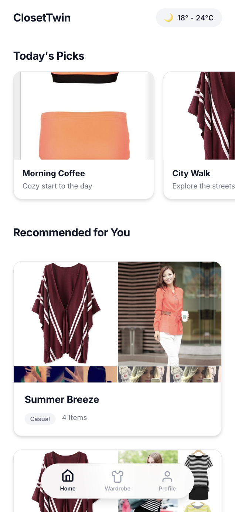
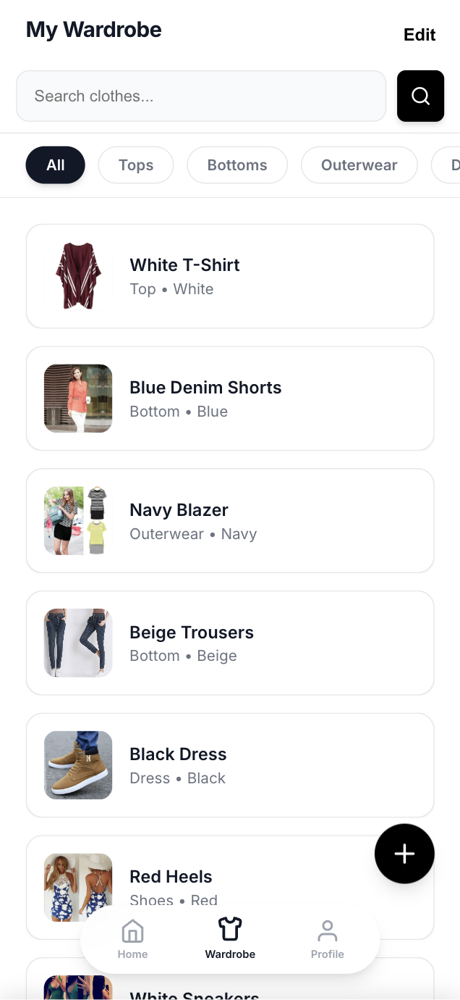
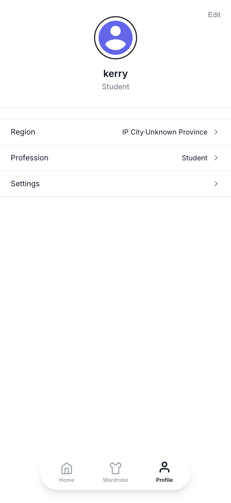

# SmartWardrobe User Guide

Welcome to SmartWardrobe! This guide will help you get the most out of your digital wardrobe experience.

---

## 📱 Features Overview

SmartWardrobe offers a seamless way to manage your clothing and get style inspiration.

### 1. Home Dashboard
View your daily recommendations and quick stats at a glance.

### 2. Digital Wardrobe
Organize your clothes by category, color, and type.

### 3. Profile & Settings
Customize your experience, manage your account, and set preferences.

---

## 📥 Installation Guide

### Android Users
TODO

### Web Users
1. Open your mobile browser (Chrome or Safari recommended).
2. Navigate to `[Your Web URL]`.
3. Tap "Share" (iOS) or the menu icon (Android) and select "Add to Home Screen".
4. Launch the app from your home screen for a full-screen experience.

---

## 📖 How to Use

### Adding a New Item
1. Go to the **Wardrobe** tab.
2. Tap the `+` button in the bottom right corner.
3. Take a photo or upload an existing image.
4. Add details like Name, Type, and Color.
5. Tap **Save Item**.

### Getting Daily Recommendations
1. Ensure you are logged in.
2. Open the **Home** tab.
3. Scroll to "Today's Picks" to see suggested outfits based on the weather.

---

## ❓ FAQ

**Q: Why can't I see my location?**
A: Ensure location permissions are enabled for your browser or the app. If automatic detection fails, you can select your region manually in the Profile settings.

**Q: How do I delete an item?**
A: Long-press on an item in the Wardrobe tab and select "Delete", or open the item details and tap the trash icon.

---

## 📞 Support

If you encounter any issues or have suggestions, please add to the [Issues](https://github.com/kerryNie-user/SmartWardrobe/issues) page.

---
**Version**: 1.1.0
**Last Updated**: 2026-02-19
**Maintainer**: SmartWardrobe Support Team
